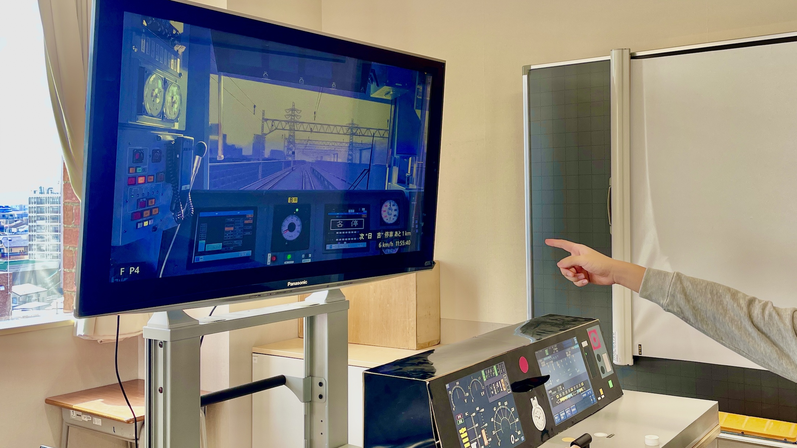
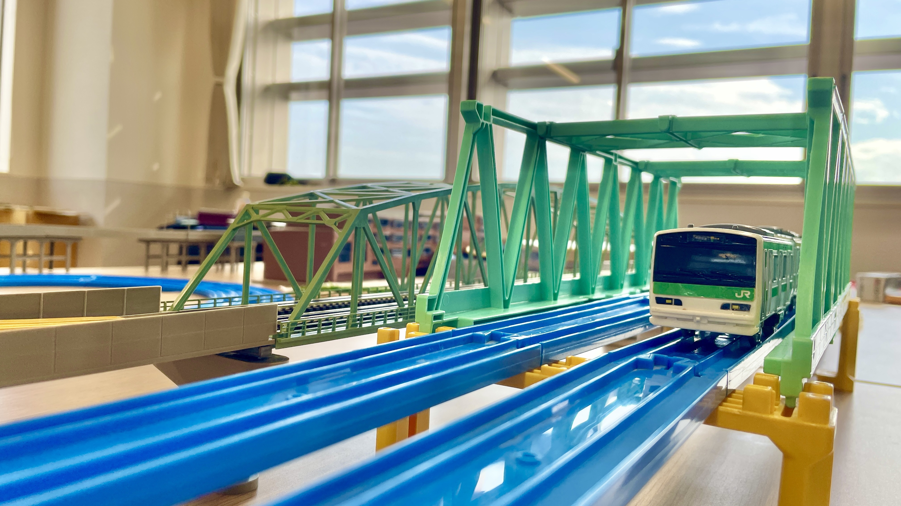
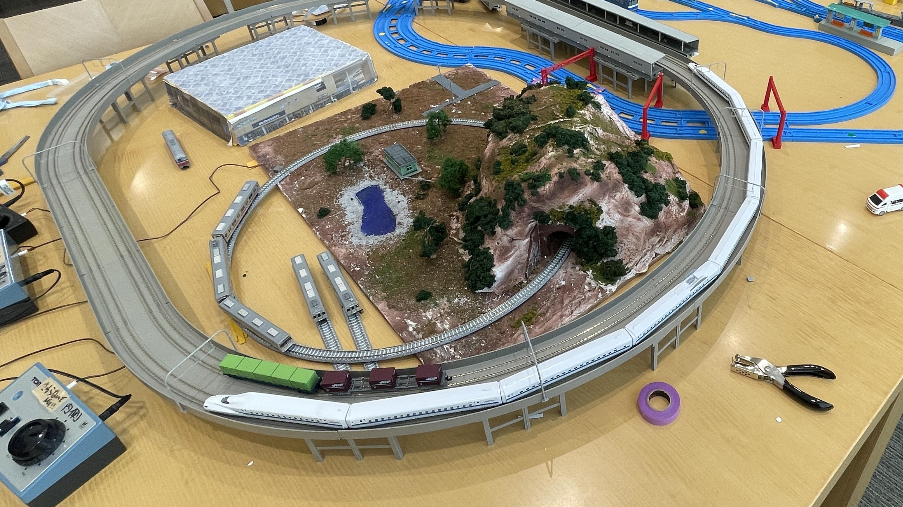
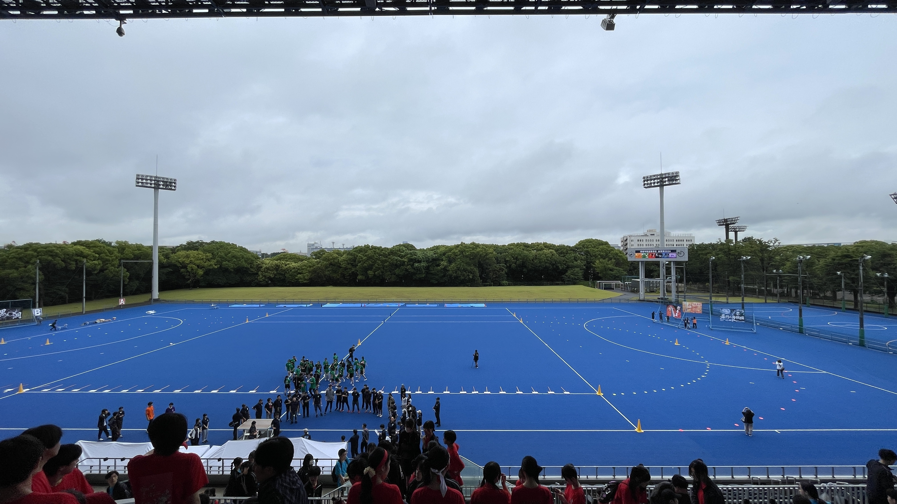
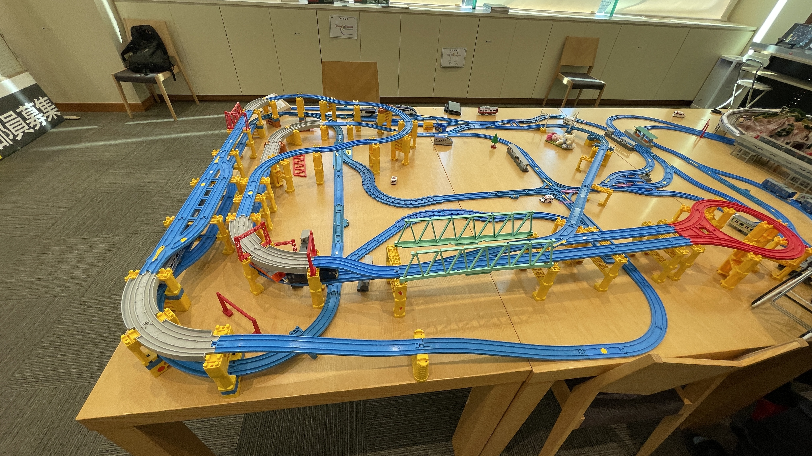
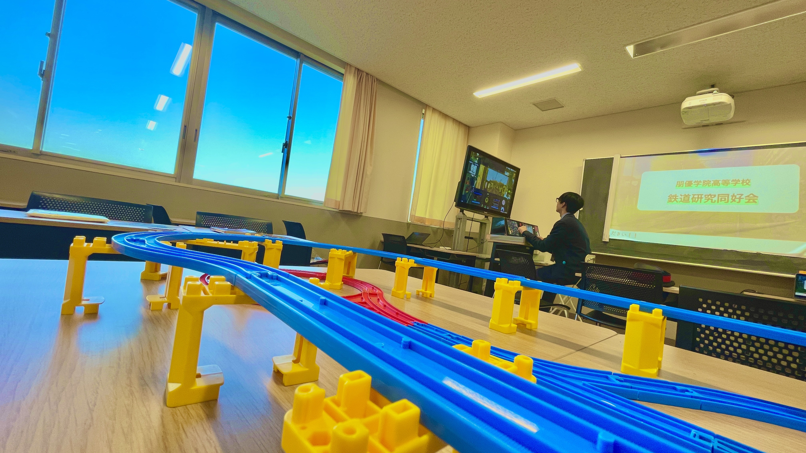
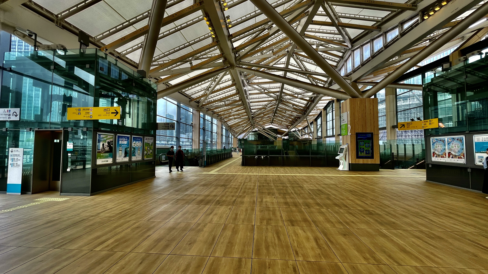
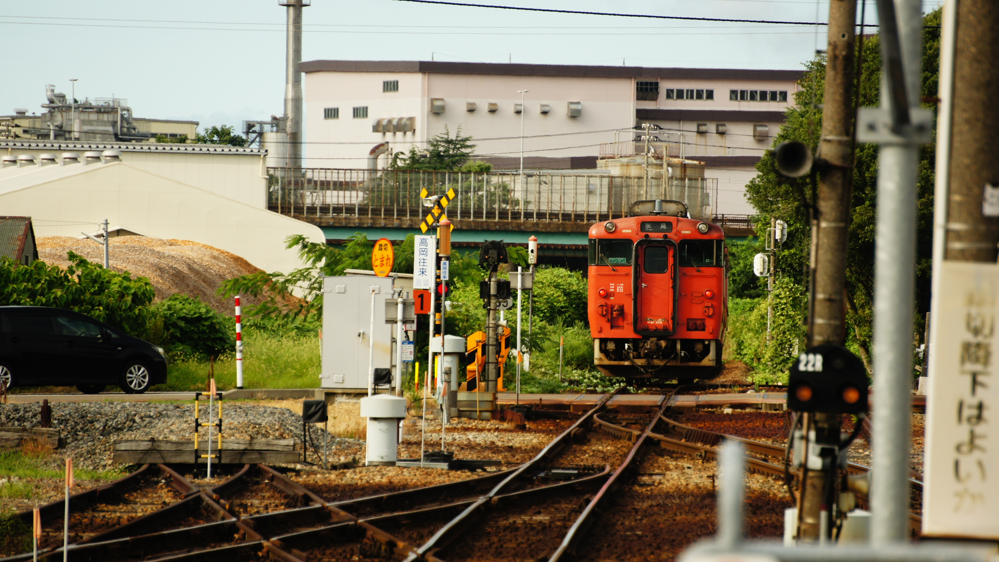

# 朋優学院鉄研について

朋優学院高等学校鉄道研究部では鉄道を軸に旅行、鉄道鬼ごっこ、運転シミュレーター、プラレール、Nゲージなど比較的鉄道に関することは自由に取り入れて活動をしています。鉄道がそこまで好きではない人も、もちろん鉄道をとても好きな人も共存し合いながらいい感じに活動をしています。

## 主な定期活動

- **運転シミュレーター**

    オープンスクールや日々の活動で特に行なっているのが運転シミュレーターです。朋優学院高等学校鉄道研究部では、**BVE**というフリーソフトの鉄道運転シミュレーターを利用しています。利用する路線はインターネットから自由にダウンロードして設定するだけなので色々な路線で遊ぶことができます。ただし、設定が少々複雑なので経験者に聞いてみるといいでしょう。

- **プラレール**

    オープンスクールで運転シミュレーターと並んで目玉になるのがプラレールの展示です。鉄道研究部のプラレールは過去に部活動予算で購入したものや歴代部員が寄付したもの、オープンスクールや文化祭で寄付していただたものなど種類様々です。レイアウトは特に決めているわけではないですが、どこかの駅の再現が多いです。

- **Nゲージ**

    鉄道研究部が同好会から部活動に昇格し、割り当てられる予算が増えたことに伴って2025年度からNゲージをベースにしたジオラマの制作を開始しました。当初は、初めての試みということもあってレイアウトの作成、必要なものの購入に時間がかかりましたがなんとか完成させることができました。これからもNゲージをベースにしたジオラマの制作は主軸の活動として行なっていきたいです。

## 特別な活動

- **体育祭**

    体育祭では、部活動アピールリレーに参加しています。これは、部活動対抗の本気リレーとは違い、あくまで部活動をアピールするためにグラウンドを練り歩くものなのでそこまで大きな活動ではありません。例年は部員募集の看板を持ちながら練り歩くだけのものでした。

- **文化祭**

    文化祭は、例年部活動の展示部門として出展しています。プラレール、Nゲージ、シミュレーターを中心に駅弁展示や写真掲示など準備時間が長く取れる文化祭だからこそできるものをいくつか行なっています。

- **オープンスクール**

    オープンスクールは文化祭とほぼ同じような動きです。ただし、準備時間が文化祭ほど取れなかったり、準備時間がオープンスクールの回によってまちまちなので適宜プラレールとNゲージはレイアウトを変えながら対応をします。シミュレーターに関しては、大体どのオープンスクールの回でも行なっています。

## 非公式な活動

- **鉄道鬼ごっこ**

    鉄道研究部の学校公式の活動ではありませんが、週末や特にゴールデンウィークのタイミングで新入部員歓迎の意を込めて某有名Youtuberと同じような内容で鉄道鬼ごっこを実施しています。23区内のエリアで逃走者はゲームマスターから与えられたミッションに対処しながら鬼から逃げます。鬼は、30分に一回公開される全員の位置情報を元に逃走者を追い詰めながらゲームを楽しみます。ミッションの内容も豊富で23区内を楽しみながら観光もできる点が魅力です。

- **宿泊活動**

    鉄道研究部としての宿泊行事や合宿はありませんが、鉄研のメンバーで遠距離旅行に行くことも多々あります。東北、近畿、北陸など部員が計画を立てて特に鉄道を使って旅行をするものです。非公式活動であるメリットを活かして、部員が行きたいところに、行きたい方法で旅行することができます。高校生は、学割を利用することがあるので鉄研の友人と遠距離旅行を楽しむのはいかがでしょうか。

